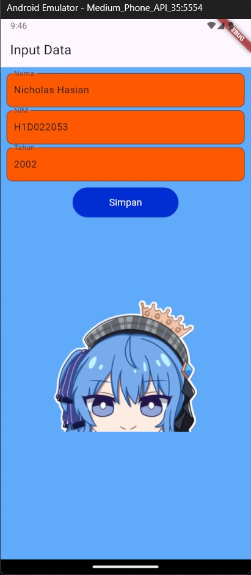

Nama    : Nicholas Hasian

NIM     : H1D022053

Shift   : C

# Proses Pengiriman Data dari Form ke Tampil Data

## 1. Input data pada form_data

Dalam widget FormData pada file form_data.dart, telah tersedia tiga TextEditingController:

```dart
final _namaController = TextEditingController();
final _nimController = TextEditingController();
final _tahunController = TextEditingController();
```

yang mana terhubung ke text field untuk nama, NIM, dan tahun.

## 2. Peyimpanan data
Saat pengguna menekan tombol "Simpan", method _tombolSimpan() akan dipanggil dan akan mengumpulkan data dari text field sebelumnya, yaitu:

String nama = _namaController.text;
String nim = _nimController.text;
int tahun = int.parse(_tahunController.text);


## 3. Mengirimkan data ke tampil_data
Data yang telah dikumpulkan kemudian dikirim ke widget TampilData pada tampil_data.dart dengan method "Navigator.push():" pada _tombolSimpan()

```dart
Navigator.of(context).push(MaterialPageRoute(
    builder: (context) =>
        TampilData(nama: nama, nim: nim, tahun: tahun)));
```

## 4. Menerima data di tampil_data
Widget TampilData kemudian akan menerima data melalui constructornya:

```dart
class TampilData extends StatelessWidget {
  final String nama;
  final String nim;
  final int tahun;

  const TampilData({
    Key? key,
    required this.nama,
    required this.nim,
    required this.tahun,
  }) : super(key: key);
}
```

## 5. Menampilkan data
Terakhir, dalam widget TampilData, data yang diterima akan digunakan untuk membuat tampilan:

```dart
  @override
  Widget build(BuildContext context) {
    final int umur = DateTime.now().year - tahun;
    return Scaffold(
      appBar: AppBar(
        backgroundColor: const Color.fromARGB(255, 255, 89, 0),
        title: const Text("Perkenalan"),
      ),
      backgroundColor: const Color.fromARGB(255, 96, 170, 250),
      body: Container(
        margin: const EdgeInsets.all(10),
        child: Table(
          columnWidths: const {
            0: FlexColumnWidth(1),
            1: FlexColumnWidth(2),
          },
          children: [
            TableRow(
              children: [
                const Text("Nama ", style: TextStyle(fontWeight: FontWeight.bold)),
                Text(nama),
              ],
            ),
            TableRow(
              children: [
                const Text("NIM ", style: TextStyle(fontWeight: FontWeight.bold)),
                Text(nim),
              ],
            ),
            TableRow(
              children: [
                const Text("Umur ", style: TextStyle(fontWeight: FontWeight.bold)),
                Text("$umur tahun"),
              ],
            ),
          ],
        ),
      ),
    );
  }
```

Dengan demikian, widget TampilData telah berhasil mengambil data yang dikirim dari form_data.dart, mengolahnya dalam menghitung umur, dan menampilkannya kepada user.


## Screenshot :

<div style="display: flex; justify-content: space-between;">
  
  
</div>
